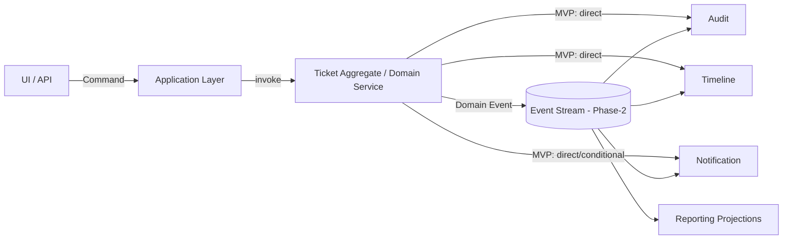
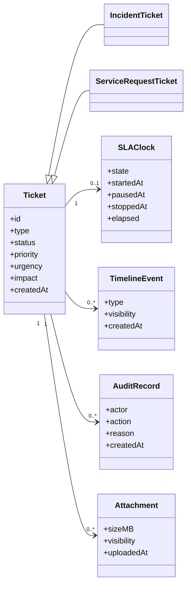
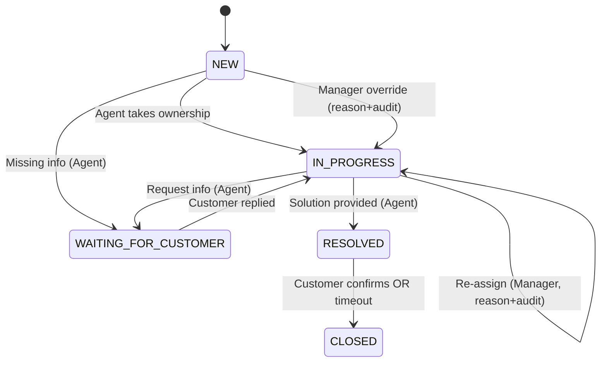
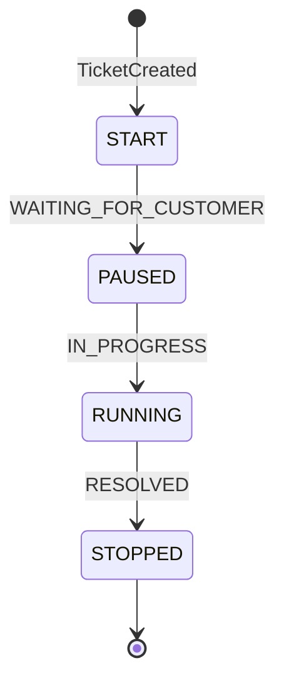
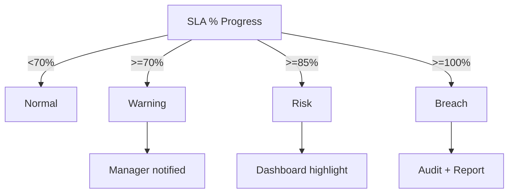
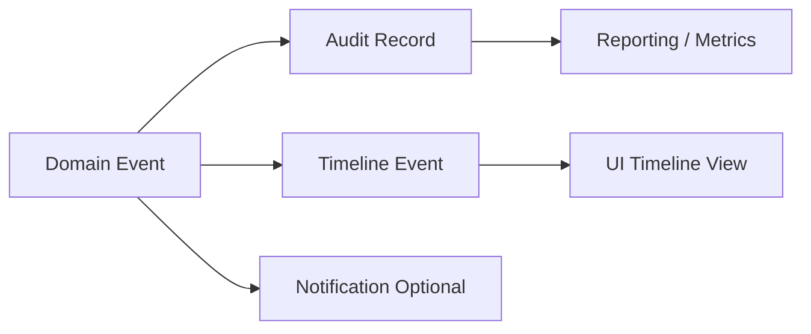
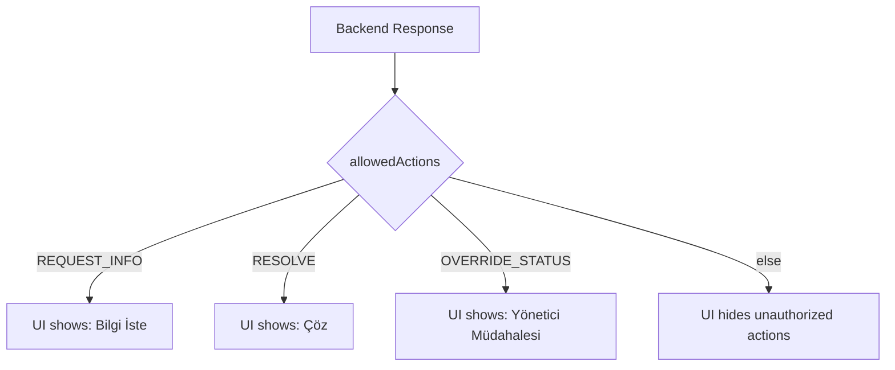
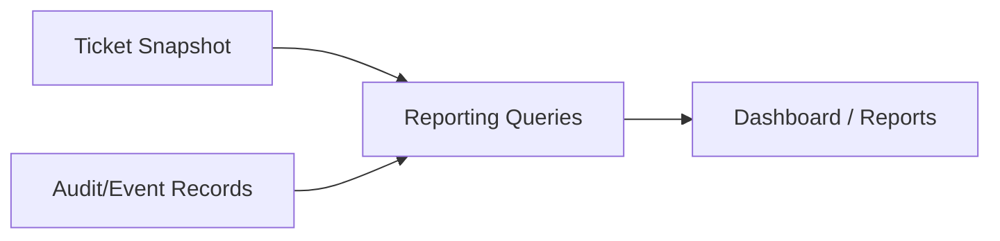
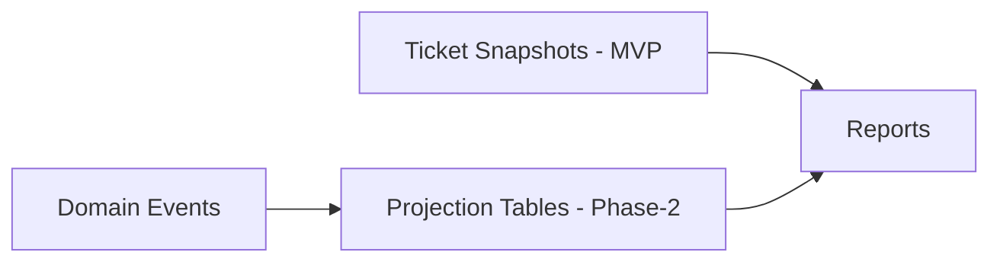

# IT Ticket Management System

## Yazılım Tasarım Dokümanı (SDD)

> **Sürüm:** v0.8 — BASELINE (Analiz Uyumlu, Revize Edilmiş)  
> **Doküman Tipi:** Yaşayan Tasarım Dokümanı  
> **Amaç:** Analiz dokümanında tanımlanan tüm iş beklentilerinin **birebir teknik karşılığını** vermek  
> **Referanslar:** ITIL v4, ServiceNow, Jira Service Management

---

# 0. Doküman Yaklaşımı ve Bağlayıcılık

Bu doküman, Yazılım Analiz Dokümanı’nda tanımlanan iş ihtiyaçları ve süreç beklentilerinin teknik tasarım düzeyindeki doğrudan karşılığı olarak hazırlanmıştır.
Analiz dokümanı sistemin ne yapması gerektiğini tanımlar; bu tasarım dokümanı ise bu beklentileri yorum katmadan, uygulanabilir teknik kurallara dönüştürür.

Bu kapsamda:

- Tasarım, analiz dokümanında tanımlı olmayan yeni iş davranışları üretmez
- Teknik kararlar, analiz kapsamını daraltamaz veya genişletemez
- Tüm süreç, rol ve kural tanımları analiz dokümanındaki ilkelere dayanır

Bu doküman yaşayan bir tasarım dokümanıdır.
Yapılacak revizyonlar, analiz dokümanında tanımlanan hedefler korunarak gerçekleştirilir.

### Application Layer & Orchestration (MVP Scope)

Bu doküman, domain kurallarını ve izin verilen davranışları tanımlar.
Bu davranışların hangi sırayla tetiklendiği ve use-case bazlı
orkestrasyonu, Application Layer sorumluluğundadır.

MVP fazında Application Layer;

- Domain kurallarını ihlal etmeyecek şekilde çağrıları koordine eder
- SLA clock, status transition ve audit tetiklerini senkronize eder
- UI ve dış sistemlerden gelen talepler için tek giriş noktası sağlar

Bu katmanın detaylı tasarımı, mimari doküman kapsamında ele alınacaktır.

### Command → Domain → Event Ayrımı (MVP + Phase-2 Teaser)

- **Command**: Application Layer tarafından başlatılan use-case isteğidir (örn. ChangeStatusCommand).
- **Domain**: Aggregate/Domain Service kuralları uygular, invariant’ları korur.
- **Domain Event**: Domain içinde gerçekleşen önemli değişimi bildirir; audit/timeline/notification gibi supporting süreçleri besler.

MVP’de supporting işlemler (audit/timeline/notification) doğrudan transaction içinde tetiklenebilir.
Phase-2’de ölçek ihtiyacı oluştuğunda event-driven akışa geçiş hedeflenir.



**Sorumluluk Ayrımı (Netleştirme)**

- **Application Layer**:
  - Use-case bazlı akışları orkestre eder
  - Status transition, SLA trigger ve escalation çağrı sırasını belirler
  - Domain kurallarını _uygulamaz_, yalnızca çağırır

- **Domain (Aggregate + Domain Service)**:
  - Status değişiminin geçerli olup olmadığını doğrular
  - SLAClock state geçişlerini kontrol eder
  - Escalation kararlarının kurallara uygunluğunu garanti eder

Bu ayrım ile:

- Akış kontrolü Application Layer’da
- İş kuralı doğrulaması Domain’dedir

---

> **Phase Boundary (Bilinçli Kapsam Sınırı)**  
> Bu SDD, analiz dokümanındaki iş davranışlarını teknik kurallara dönüştürmeye odaklanır.  
> Bu fazda aşağıdaki mimari ayrıntılar _bilinçli olarak_ detaylandırılmamıştır:
>
> - Application layer (use-case orchestration)
> - Domain service vs aggregate sınırları
> - Command / Query ayrımı (CQRS)
>
>   _Phase-2 Öncelikli Konular_
>
> 1. Event granularity ayrıştırma
> 2. Çoklu SLA clock desteği
> 3. Notification motoru genişletme
> 4. CQRS değerlendirmesi
> 5. Reporting optimizasyonu

> **Gerekçe:** MVP’de hedef; statü akışları, SLA clock, RBAC, audit/timeline izlenebilirliği gibi iş davranışlarının doğrulanmasıdır.  
> Bu mimari kararlar, ilk çalışma prototipinden elde edilecek geri bildirimlere göre Phase-2’de kesinleştirilecektir.

---

# 1. Domain Model Ayrımı (Analizle Uyumlu)

Sistem, analiz dokümanında tanımlanan iş süreçlerini net ve kontrol edilebilir şekilde modelleyebilmek amacıyla core ve supporting domain’ler olarak ayrıştırılmıştır.

## 1.1 Core Domain

Core domain, doğrudan iş değeri üreten ve analiz dokümanında tanımlanan temel süreçleri kapsar:

- Ticket
- Incident
- Service Request
- Önceliklendirme (Urgency / Impact)
- SLA & Escalation

### Core Domain – Aggregate ve Invariant’lar (MVP)

| Aggregate Root       | Kapsam                     | Temel Invariant                           |
| -------------------- | -------------------------- | ----------------------------------------- |
| Ticket               | Status, Priority, SLAClock | Geçersiz status transition yapılamaz      |
| Ticket               | SLAClock                   | SLA state yalnızca tanımlı akışta ilerler |
| Ticket               | Assignment                 | Yetkisiz rol assignment yapamaz           |
| ServiceRequestTicket | Approval                   | Onay tamamlanmadan RESOLVED olamaz        |

Bu alanlar, sistemin iş perspektifinden beklenen ana davranışlarını belirler ve süreç akışını doğrudan etkiler.

### Domain Service vs Aggregate Ayrımı (Tasarım Prensipleri)

Bu sistemde domain modeli, davranışların nerede konumlanacağına dair
aşağıdaki prensiplerle tasarlanmıştır:

- **Aggregate Root (Ticket)**:
  - State (status, priority) tutarlılığından sorumludur
  - Geçersiz status transition’ları engeller
  - SLAClock state geçişlerini doğrular
  - Invariant’ları her zaman kendi sınırları içinde korur

- **Domain Service**:
  - Birden fazla aggregate veya dış veri gerektiren kararları içerir
  - Priority hesaplama (Urgency / Impact matrisi)
  - SLA escalation kararları (%70 / %85 / %100)
  - Approval sonucu değerlendirme (Service Request)

Bu ayrım ile:

- Aggregate’lar kuralları **uygular**
- Domain Service’ler kararları **hesaplar**
- Application Layer ise yalnızca **orkestrasyon** yapar

## 1.2 Supporting Domain

Supporting domain, core domain süreçlerinin izlenebilirliğini, denetlenebilirliğini ve raporlanabilirliğini sağlamak amacıyla konumlandırılmıştır:

- Audit
- Logging
- Timeline
- Notification
- Reporting

> Supporting domain bileşenleri, core domain davranışlarını tetiklemez veya değiştirmez; yalnızca gerçekleşen aksiyonları kaydeder ve görünür kılar.Bu ayrım, analiz dokümanında vurgulanan kurallara dayalı süreç, şeffaflık ve denetlenebilirlik ilkelerinin teknik karşılığını oluşturur.



> **Aggregate Boundary – Ölçeklenebilirlik Notu**
>
> Attachment, TimelineEvent ve AuditRecord bileşenleri
> MVP fazında Ticket aggregate içinde modellenmiştir.
>
> Sistem ölçeklendikçe bu bileşenler:
>
> - Ayrı aggregate
> - Ayrı bounded context
>   olarak ayrıştırılmaya uygundur.
>
> Mevcut tasarım, MVP için tutarlılığı ve basitliği önceliklendirir.

#### Split Sinyalleri (Ölçülebilir)

Aşağıdaki sinyaller gözlemlenirse Attachment / Timeline / Audit bileşenleri Ticket aggregate’tan ayrıştırılmalıdır:

- **Performans**: Ticket update işleminde P95 latency > 300ms (yük altında)
- **Veri büyümesi**: Tek bir ticket için timeline event sayısı > 500 veya attachment > 50
- **Çakışma**: Aynı ticket üzerinde optimistic lock conflict oranı > %5
- **Depolama**: Ticket satırı veya ilişkili join maliyeti belirgin artış (örn. sık timeout)
- **Organizasyonel**: Timeline/Audit farklı ekip tarafından ayrı sprintlerle geliştirilmeye başlanır

Bu sinyaller, Phase-2’de bounded context ayrıştırma kararının tetikleyicileri olarak kullanılır.

---

# 2. Incident vs Service Request Tasarımı

## 2.1 Ayrımın Nedeni

Analiz dokümanında Incident ve Service Request süreçlerinin **karışması operasyonel risk** olarak tanımlanmıştır.

## 2.2 Domain Ayrımı

Ticket üst varlıktır; alt türler şunlardır:

- IncidentTicket
- ServiceRequestTicket

## 2.3 Incident Kuralları

- Acil durum odaklı
- SLA zorunlu
- Otomatik escalation açık

## 2.4 Service Request Kuralları

- Katalog bazlı
- SLA opsiyonel
- Onay (approval) adımı eklenebilir

### Approval Flow (Service Request – MVP)

- Service Request, opsiyonel onay adımı içerebilir
- Approval tamamlanmadan RESOLVED durumuna geçilemez
- Reddedilen talepler CLOSED durumuna alınır (reason + audit)

Approval akışı, ticket yaşam döngüsünü genişletmez;
mevcut statüler içinde kontrol mekanizması olarak çalışır.

---

# 3. Önceliklendirme (Urgency / Impact)

## 3.1 Priority Modeli

Priority aşağıdaki matrisle hesaplanır:

Priority = f(Urgency, Impact)

| Impact \\ Urgency | Low    | Medium | High     |
| ----------------- | ------ | ------ | -------- |
| Low               | LOW    | LOW    | MEDIUM   |
| Medium            | LOW    | MEDIUM | HIGH     |
| High              | MEDIUM | HIGH   | CRITICAL |

## 3.2 Değişim Kuralları

- Customer urgency önerir
- Agent impact belirler
- Priority değişimi **audit zorunludur**

---

# 4. Ticket Lifecycle & Edge Case’ler

## 4.1 Temel Lifecycle

```
NEW → IN_PROGRESS → WAITING_FOR_CUSTOMER ↔ IN_PROGRESS → RESOLVED → CLOSED
```



## 4.2 Yanıtsız Müşteri (Abandoned Case)

- WAITING_FOR_CUSTOMER state’inde belirlenen süre aşılırsa:
  - AUTO_REMINDER event
  - Süre dolarsa AUTO_CLOSE önerisi
  - Manager onayı ile CLOSED

---

# 5. SLA, Escalation ve Risk Yönetimi

## 5.1 SLA Clock

- TicketCreated → START
- WAITING_FOR_CUSTOMER → PAUSE
- IN_PROGRESS → RESUME
- RESOLVED → STOP

### 5.1.1 SLA Clock State Flow



> Bu akış, analiz dokümanında tanımlanan “SLA’nın adil yönetimi” ilkesinin teknik karşılığını temsil eder.

> **Extensibility Notu**
>
> MVP fazında sistem tek bir SLAClock üzerinden ilerler.
>
> Phase-2’de:
>
> - Response SLA
> - Resolution SLA
>   gibi farklı SLA tipleri tanımlanması durumunda,
>   her SLA türü için ayrı clock modeli uygulanabilir.

## 5.2 Escalation Seviyeleri

| SLA Seviyesi | Tetik Noktası | Sistem Davranışı              |
| ------------ | ------------- | ----------------------------- |
| Normal       | < %70         | Normal süreç devam eder       |
| Warning      | ≥ %70         | Manager bilgilendirilir       |
| Risk         | ≥ %85         | Dashboard üzerinde vurgulanır |
| Breach       | ≥ %100        | Audit kaydı + raporlama       |



---

# 6. Timeline, Internal / External İçerik

## 6.1 İçerik Türleri

- External Comment
- Internal Comment
- External Worklog
- Internal Worklog
- System Event

| İçerik Türü      | Customer Görür | Agent Görür | Manager Görür |
| ---------------- | -------------- | ----------- | ------------- |
| External Comment | ✓              | ✓           | ✓             |
| Internal Comment | ✗              | ✓           | ✓             |
| External Worklog | ✓              | ✓           | ✓             |
| Internal Worklog | ✗              | ✓           | ✓             |
| System Event     | ✓              | ✓           | ✓             |

## 6.2 Timeline Davranışı

- Customer yalnızca external kayıtları görür
- Agent/Manager tümünü görür
- Her kayıt timeline event üretir

---

# 7. Attachment Yönetimi

| Kural          | Açıklama                                 |
| -------------- | ---------------------------------------- |
| Görünürlük     | Internal / External olarak ayrılır       |
| Maksimum Boyut | 10 MB                                    |
| Dosya Türü     | Sistem tarafından kısıtlanabilir         |
| Yetkilendirme  | Rol bazlı upload                         |
| Denetim        | Her upload audit + timeline event üretir |

> Her attachment işlemi audit ve timeline event üretir.

---

# 8. Failure Modes (MVP)

Bu bölüm, analiz dokümanındaki “kurallara dayalı süreç” ve “denetlenebilirlik” ilkelerinin
hata/istisna anlarındaki teknik karşılığını tanımlar.

| Failure Mode                  | Örnek Durum                      | Sistem Tepkisi                                   | HTTP            | Audit / Timeline                             |
| ----------------------------- | -------------------------------- | ------------------------------------------------ | --------------- | -------------------------------------------- |
| Illegal Status Transition     | CLOSED → IN_PROGRESS denenmesi   | İşlem reddedilir, mevcut state korunur           | 409 Conflict    | Audit: ✓ (deneme kaydı), Timeline: opsiyonel |
| SLA Clock Inconsistency       | STOPPED iken RESUME tetiklenmesi | SLA state normalize edilir veya işlem reddedilir | 409 Conflict    | Audit: ✓, Timeline: System Event             |
| Unauthorized Override Attempt | Agent “ManagerOverride” dener    | Yetkisiz işlem reddedilir                        | 403 Forbidden   | Audit: ✓ (security), Timeline: ✗             |
| Invalid Payload               | Priority değeri tanımsız         | Validasyon hatası döner                          | 400 Bad Request | Audit: ✗ (opsiyonel), Timeline: ✗            |
| Not Found                     | TicketId yok                     | Bulunamadı                                       | 404 Not Found   | Audit: opsiyonel, Timeline: ✗                |

> **Timeline Kuralı**
>
> Security ve yetki ihlali kaynaklı failure’lar
> customer timeline’a yansımaz.
>
> Bu olaylar yalnızca audit kayıtlarında tutulur.

---

# 9. RBAC ve Yetki Matrisi

| Aksiyon                  | Customer | Agent | Manager            |
| ------------------------ | -------- | ----- | ------------------ |
| Ticket Oluşturma         | ✓        | ✓     | ✓                  |
| Ticket Durumu Değiştirme | ✗        | ✓     | ✓ (override)       |
| Ticket Atama             | ✗        | ✓     | ✓                  |
| Öncelik Değiştirme       | ✗        | ✓     | ✓                  |
| Ticket Kapama            | ✗        | ✓     | ✓                  |
| Yönetici Müdahalesi      | ✗        | ✗     | ✓ (reason + audit) |

Manager override işlemleri **reason + audit zorunlu**.

---

# 10. Event Catalog (Zorunlu)

> **Event Granularity Prensibi (MVP)**
>
> MVP fazında event’ler, operasyonel izlenebilirliği sağlamak amacıyla
> daha genel isimlendirilmiştir (örn. TicketUpdated).
>
> Phase-2’de event-driven mimariye geçişte:
>
> - AssignmentChanged
> - ImpactChanged
> - UrgencyChanged
>   gibi daha spesifik event’lere ayrıştırılması planlanmaktadır.

- TicketCreated
- TicketUpdated
- StatusChanged
- PriorityChanged
- SLAPaused
- SLAResumed
- SLABreachRisk
- SLABreached
- ManagerOverride
- AttachmentAdded

| Event           | Audit Kaydı        | Timeline Event   | Notification |
| --------------- | ------------------ | ---------------- | ------------ |
| TicketCreated   | ✓                  | System Event     | Opsiyonel    |
| StatusChanged   | ✓                  | System Event     | Opsiyonel    |
| PriorityChanged | ✓                  | System Event     | Opsiyonel    |
| SLAPaused       | ✓                  | System Event     | ✗            |
| SLAResumed      | ✓                  | System Event     | ✗            |
| SLABreachRisk   | ✓                  | System Event     | ✓            |
| SLABreached     | ✓                  | System Event     | ✓            |
| ManagerOverride | ✓ (reason zorunlu) | System Event     | Opsiyonel    |
| AttachmentAdded | ✓                  | Attachment Event | Opsiyonel    |

> Her event, denetlenebilirlik ve geriye dönük inceleme amacıyla audit ve timeline ile ilişkilendirilir.

### API Response Edge-Cases (Özet)

| Senaryo                   | HTTP            | Açıklama                          |
| ------------------------- | --------------- | --------------------------------- |
| Illegal status transition | 409 Conflict    | Kurallara aykırı geçiş reddedilir |
| Unauthorized action       | 403 Forbidden   | RBAC ihlali                       |
| Ticket not found          | 404 Not Found   | Geçersiz id                       |
| Invalid payload           | 400 Bad Request | Validasyon hatası                 |
| Concurrency conflict      | 409 Conflict    | Versiyon uyuşmazlığı              |



### Notification Stratejisi (MVP)

| Event           | Notification Davranışı | Gerekçe                        |
| --------------- | ---------------------- | ------------------------------ |
| TicketCreated   | Koşullu                | Assignment varsa bilgilendirme |
| StatusChanged   | Koşullu                | Customer-facing statülerde     |
| SLABreachRisk   | Her zaman              | Proaktif müdahale              |
| SLABreached     | Her zaman              | Operasyonel kritik             |
| ManagerOverride | Opsiyonel              | Audit öncelikli                |
| AttachmentAdded | Koşullu                | External attachment durumunda  |

Notification mekanizması, kullanıcıyı bilgilendirmeyi amaçlar;
audit ve timeline kayıtlarının yerini almaz.

Notification kuralları aşağıdaki prensiplere göre çalışır:

- SLA bazlı: SLABreachRisk, SLABreached → her zaman
- Status bazlı: Customer-facing status değişimleri
- Rol bazlı: Manager override yalnızca yöneticilere

---

# 11. API & UI Contract

Backend her ticket response’unda:



```json
{
  "status": "IN_PROGRESS",
  "priority": "HIGH",
  "allowedActions": ["REQUEST_INFO", "RESOLVE"],
  "slaRiskLevel": "WARNING"
}
```

| Ticket Status        | Rol      | allowedActions Örnekleri                   |
| -------------------- | -------- | ------------------------------------------ |
| NEW                  | Agent    | TAKE_OWNERSHIP, REQUEST_INFO               |
| IN_PROGRESS          | Agent    | REQUEST_INFO, ADD_WORKLOG, RESOLVE         |
| WAITING_FOR_CUSTOMER | Customer | ADD_COMMENT, ADD_ATTACHMENT                |
| RESOLVED             | Customer | CONFIRM_CLOSE, REOPEN_REQUEST              |
| ANY                  | Manager  | OVERRIDE_STATUS, REASSIGN, CHANGE_PRIORITY |

### API Failure Response Örnekleri

> JSON formatında örnek Failure Response'ları aşağıda verilmiştir:

// 409 - Illegal Status Transition
{
"errorCode": "INVALID_STATUS_TRANSITION",
"message": "Ticket cannot transition from CLOSED to IN_PROGRESS",
"currentStatus": "CLOSED"
}
// 403 - Unauthorized Action
{
"errorCode": "UNAUTHORIZED_ACTION",
"message": "User role is not allowed to perform this action"
}

### Reopen Senaryosu (MVP)

- REOPEN_REQUEST aksiyonu yalnızca RESOLVED durumunda kullanılabilir
- Ticket, IN_PROGRESS durumuna geri döner
- SLAClock:
  - Daha önce STOPPED ise yeniden başlatılır
  - Önceki SLA süresi audit kayıtları üzerinden korunur

### Concurrency & Tutarlılık (MVP)

Eşzamanlı talepler sonucunda oluşabilecek tutarsızlıklar,
optimistic locking ve transaction bazlı güncellemelerle yönetilir.

- Status değişimleri atomik olarak ele alınır
- SLAClock state güncellemeleri tekil işlem kapsamında yapılır
- Ticket aggregate, versiyonlanan tek tutarlılık sınırıdır

#### Çakışma Senaryoları (MVP)

| Senaryo                              | Çözüm                         |
| ------------------------------------ | ----------------------------- |
| Status change + SLA update çakışması | Aynı transaction, tek version |
| Agent update + Manager override      | Manager override öncelikli    |
| İki agent aynı anda update           | Versiyon uyuşmazlığı → 409    |
| Reopen + resolve çakışması           | İlk commit kazanır            |

#### Kilitleme ve Versiyonlama Stratejisi

- Ticket üzerinde `version` alanı bulunur
- Status, assignment ve SLAClock güncellemeleri
  aynı transaction içinde yapılır
- Versiyon uyuşmazlığında işlem reddedilir
- HTTP 409 Conflict döndürülür

Bu yaklaşım, aynı ticket üzerinde eşzamanlı
işlem denemelerinde veri tutarlılığını garanti eder.

---

# 12. Reporting (MVP)

### Metrik Tanımları (MVP)

| Metrik                | Hesaplama                        |
| --------------------- | -------------------------------- |
| Ortalama çözüm süresi | IN_PROGRESS → RESOLVED           |
| SLA compliance        | SLAClock.elapsed ≤ SLA threshold |
| Escalation sayısı     | SLABreachRisk + SLABreached      |

Minimum raporlar:

- SLA compliance
- Ortalama çözüm süresi
- Escalation sayıları
- Agent iş yükü

## 11.1 Reporting Veri Kaynağı (MVP)

MVP fazında raporlama; full event-sourcing yaklaşımı yerine,
ticket snapshot verileri ve event/audit kayıtlarından türetilen ölçümlerle üretilir.

- **Snapshot kaynakları:** Ticket.status, Ticket.priority, SLAClock.elapsed, timestamps
- **Event/Audit kaynakları:** StatusChanged, PriorityChanged, SLABreachRisk, SLABreached, ManagerOverride



#### Snapshot Yaklaşımının Sınırı (Ne zaman yetmeyecek?)

Snapshot tabanlı raporlama, MVP için yeterlidir; ancak aşağıdaki durumlarda yetersiz kalır:

- **Yük**: Rapor sorguları toplam okuma trafiğinin > %30’una ulaştığında
- **Gecikme**: Dashboard metriği “near real-time” (örn. < 5 sn) beklenmeye başladığında
- **Karmaşıklık**: “Zaman içinde trend / adım adım akış” (funnel) gibi event-temelli analizler gerektiğinde
- **Maliyet**: Sık rapor sorguları üretim veritabanını baskıladığında (P95 query > 500ms)

Phase-2 çözüm yönü:

- Domain event’lerden türetilen **read model / projection** tablosu oluşturmak
- Raporları bu projection üzerinden almak (operational DB yükünü azaltmak)
-



---

# 13. Non-Functional Requirements (Analizle Uyum)

- i18n: message catalog tabanlı
- Performance: pagination zorunlu
- Security: JWT + RBAC
- Observability: log + audit + timeline
- Pagination: max page size = 50
- JWT expiry: 15 dakika
- Audit retention: minimum 1 yıl

> Not: Aşağıdaki konular bu fazda tasarım kapsamında ele alınmamıştır:
>
> - High availability ve disaster recovery senaryoları
> - Otomatik ölçekleme ve load balancing
> - Harici observability platformları (APM, tracing)
>
> Bu başlıklar, sistem davranışı doğrulandıktan sonra ileri fazlarda değerlendirilir.

---

# 14. Analiz → Tasarım İzlenebilirlik (Traceability)

| Analiz Beklentisi                   | Tasarım Bölümü | Kanıt Artefakt                   |
| ----------------------------------- | -------------- | -------------------------------- |
| Süreçlerin kurallı işlemesi         | Bölüm 4        | Status transition kuralları      |
| SLA’nın adil yönetimi               | Bölüm 5        | SLA clock + risk seviyeleri      |
| Önceliklendirme şeffaflığı          | Bölüm 3        | Impact / Urgency matrisi         |
| Denetlenebilirlik                   | Bölüm 6–9      | Audit + timeline + event catalog |
| Yönetici müdahalesi                 | Bölüm 8        | Override + reason zorunluluğu    |
| UI davranışlarının kontrollü olması | Bölüm 10       | allowedActions kontratı          |

---

# Glossary

| Terim            | Açıklama                                      |
| ---------------- | --------------------------------------------- |
| Manager Override | Yönetici tarafından yapılan istisnai müdahale |
| AllowedActions   | UI’da gösterilecek izinli aksiyonlar          |
| SLAClock         | SLA süresini takip eden mekanizma             |

---

# 15. Sonuç

Bu doküman:

- Analiz dokümanındaki tüm kritik beklentileri kapsar
- Teknik davranışları açıkça tanımlar
- Akademik ve sektörel olarak savunulabilir

Bu doküman, analiz aşamasında tanımlanan iş beklentilerinin
fazlandırılmış ve denetlenebilir teknik karşılığını sunar.

Doküman; akademik değerlendirme, sektörel uygulama ve yazılım geliştirme
süreçleri için bağlayıcı bir referans niteliğindedir.
